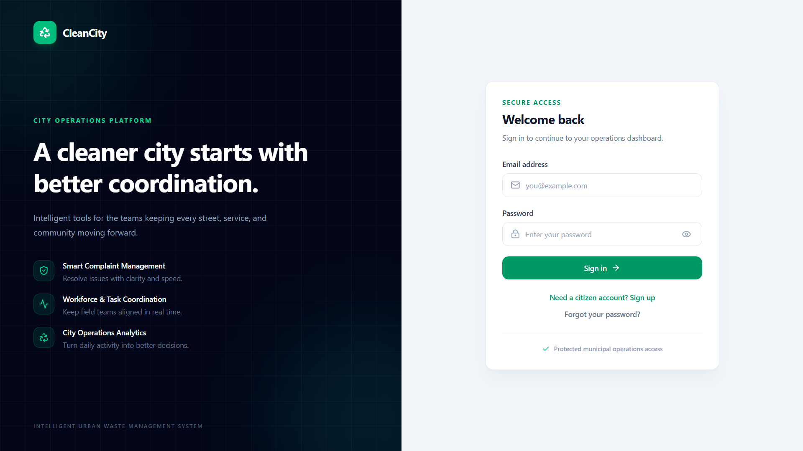
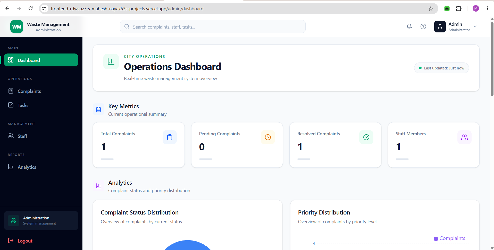
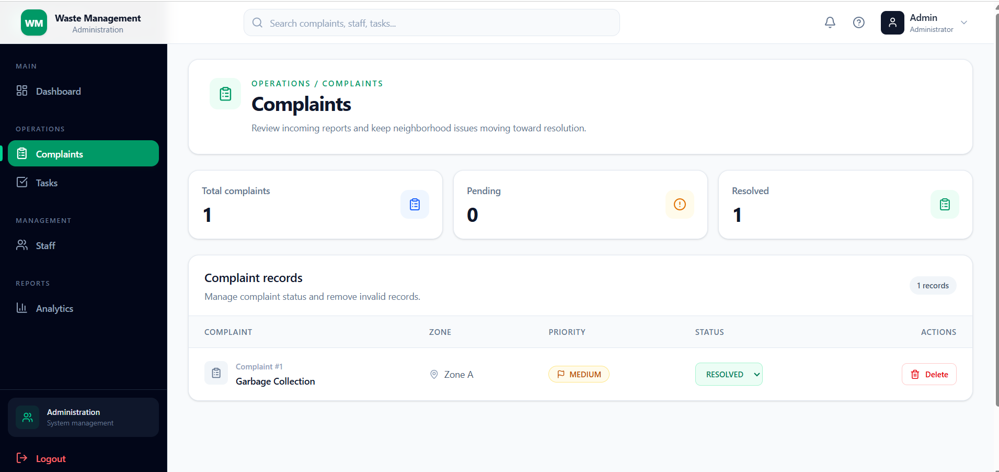
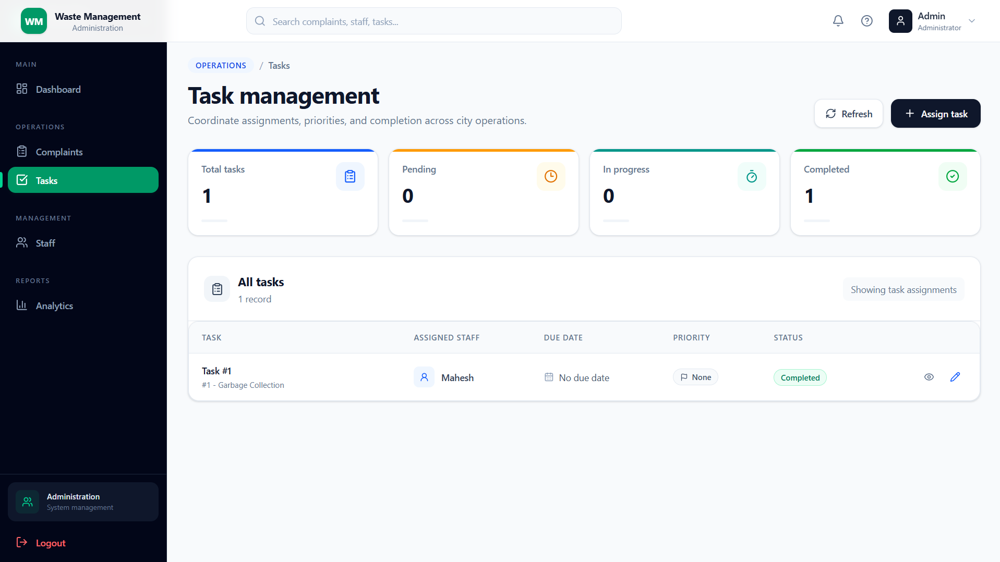
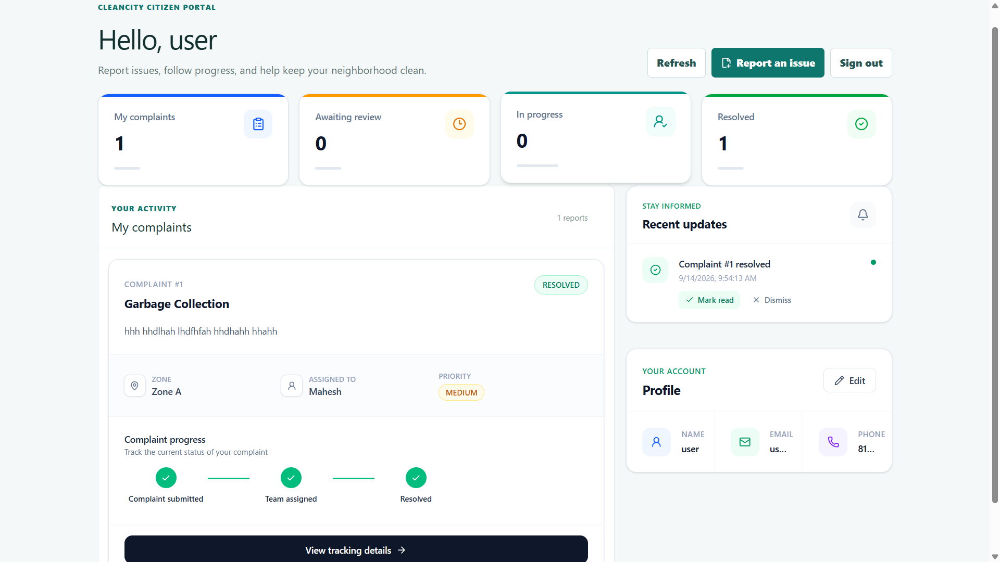
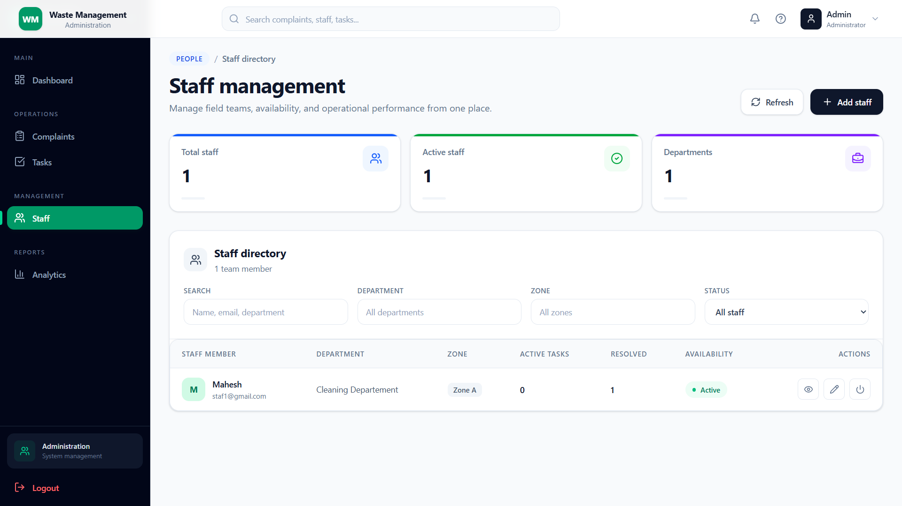

# Intelligent Urban Waste Management System

A full-stack web application designed to modernize urban waste management through digital complaint reporting, complaint tracking, staff assignment, waste collection coordination, notifications, and administrative monitoring.

The system provides separate dashboards and role-based functionality for **Citizens, Staff, and Administrators**, enabling efficient communication and centralized waste-management operations.

---

## Live Application

### Frontend
https://frontend-rdwsbz7rs-mahesh-nayak53s-projects.vercel.app

### Backend
https://intelligent-urban-waste-backend.onrender.com

### Backend Health Check
https://intelligent-urban-waste-backend.onrender.com/health

### GitHub Repository
https://github.com/mahesh-nayak53/intelligent-urban-waste-management

---

## Project Status

**Status:** Deployed and Working

- Frontend deployed on Vercel
- Backend deployed on Render
- Database hosted on TiDB Cloud
- REST API integrated with frontend
- JWT authentication implemented
- Role-based access control implemented
- MySQL-compatible database integration completed

---

# Overview

The **Intelligent Urban Waste Management System** provides a centralized digital platform for managing waste-related complaints and collection activities.

Citizens can report waste-related problems, upload supporting images, track complaint progress, and receive notifications.

Staff members can view complaints assigned to them, update complaint statuses, and manage waste collection activities.

Administrators can manage users, staff, complaints, assignments, notifications, and system statistics through an administrative dashboard.

The goal of the system is to reduce manual processes and improve transparency, communication, and efficiency in urban waste management.

---

# Objectives

The main objectives of this project are:

- Digitize urban waste complaint management
- Allow citizens to report waste-related problems
- Provide complaint status tracking
- Enable administrators to assign complaints to staff
- Help staff manage assigned complaints
- Improve communication through notifications
- Provide dashboards and analytical statistics
- Reduce manual waste-management processes
- Centralize waste-related information
- Improve coordination between citizens, staff, and administrators

---

# Features

## Authentication and Authorization

- User registration
- Secure user login
- JWT-based authentication
- Password hashing
- Logout functionality
- Role-based access control
- Protected routes
- Secure REST API endpoints

---

# Citizen Features

Citizens can:

- Create an account
- Login securely
- Submit waste complaints
- Upload complaint images/files
- View submitted complaints
- Track complaint status
- View complaint history
- Receive notifications
- View recent activities
- Monitor complaint progress

---

# Staff Features

Staff members can:

- Login securely
- Access staff dashboard
- View assigned complaints
- View complaint details
- Update complaint status
- Manage waste collection tasks
- View notifications
- Monitor assigned activities

---

# Admin Features

Administrators can:

- Access administrative dashboard
- Manage users
- Manage staff members
- View all complaints
- View complaint details
- Assign complaints to staff
- Update complaint status
- Manage waste collection activities
- View notifications
- Monitor system activities
- View dashboard statistics
- Analyze complaint trends
- Monitor complaint priorities
- View zone-based statistics

---

# Dashboard and Analytics

The system provides dashboards for monitoring waste-management activities.

### Complaint Status

Displays complaints according to their current status.

### Complaint Trends

Provides visual insights into complaint activity over time.

### Priority Distribution

Displays complaints according to priority levels.

### Zone Statistics

Provides complaint statistics based on geographical zones.

### Activity Feed

Displays recent activities performed within the system.

### Notifications

Allows users and staff to view and manage system notifications.

---

# Technology Stack

## Frontend

| Technology | Purpose |
|---|---|
| React.js | User interface development |
| Vite | Frontend development and build tool |
| JavaScript | Application logic |
| Tailwind CSS | Responsive UI styling |
| React Router | Client-side routing |
| Axios | REST API communication |
| Recharts | Dashboard charts and analytics |

---

## Backend

| Technology | Purpose |
|---|---|
| Java | Backend programming |
| Spring Boot | Backend framework |
| Spring Web | REST API development |
| Spring Data JPA | Database access |
| Hibernate ORM | Object-relational mapping |
| Spring Security | Authentication and authorization |
| JWT | Token-based authentication |
| Maven | Dependency and build management |

---

## Database

| Technology | Purpose |
|---|---|
| TiDB Cloud | Cloud database |
| MySQL-compatible SQL | Database platform |
| JPA | Persistence API |
| Hibernate | ORM |
| MySQL Connector/J | JDBC database driver |

### Database Architecture

```text
Spring Data JPA
       ↓
Hibernate ORM
       ↓
MySQL Connector/J
       ↓
TiDB Cloud

```

### Screenshots

## Login Page


## Admin DashBoard


## Complaints


## Task Management


## Citizen


## Staff Management


## Staff Dashboard


### Author
Mahesh 
## Full-Stack Java Developer | React Developer

## GitHub:

https://github.com/mahesh-nayak53
